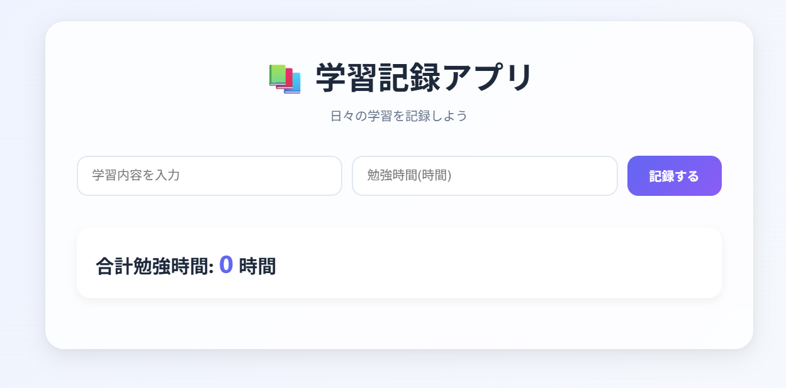

# 学習記録サイト

## 概要

学習内容や学習時間を記録するために制作したWebアプリです。

学習した内容を入力し、日々の学習状況を管理できるようにしました。

## 公開URL

https://chihaya6.github.io/study-log/

## 画面イメージ

## 使用技術

* HTML
* CSS
* JavaScript

## 実装機能

* 学習内容の記録
* 学習時間の記録
* 学習履歴の表示
* データの保存（該当する場合）

## 工夫した点

* シンプルで見やすい画面設計を意識しました。
* 入力した内容を一覧で確認できるようにしました。
* ユーザーが直感的に操作できるようなUIを目指しました。

## 学んだこと

* HTMLによる画面構築
* CSSによるレイアウト・デザイン調整
* JavaScriptによるDOM操作
* イベント処理の実装
* データ管理の基礎

## 制作背景

プログラミング学習を継続する中で、自分の学習状況を可視化したいと考え制作しました。

## 今後追加したい機能

* 学習時間のグラフ表示
* 編集機能
* 削除機能
* カテゴリー分け機能
* 検索機能

## 制作期間

1日間

## 作者

GitHub: https://github.com/CHIHAYA6
